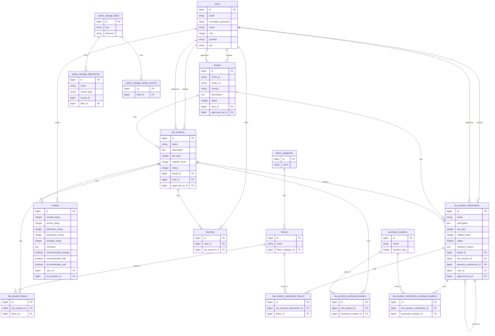

# みんなの紅茶図鑑
#### 「自分にぴったりの一杯」がすぐに見つかる、探して・育てる紅茶データベース

### サービスURL
https://www.kocha-zukan.com/

***

## ✒️ サービス概要
本サービスは、ブランドの垣根を越えて紅茶を検索・比較できる **「辞典型データベースアプリ」** です。

フレーバーや茶葉タイプ、カフェインの有無といった詳細なスペックから、自分の好みに合った紅茶を直感的に見つけることができます。また、5段階の定量評価による「ライトレビュー」機能を備えており、初心者でも味の傾向を一目で把握できるのが特徴です。

***

## 🧱 開発背景と解決したい課題
**紅茶初心者にとっての「情報の壁」を解消したい**

現在、紅茶の情報を探そうとすると、個人ブログや SNS の感想が主流です。しかし、それらは **「主観的なレビュー」** が中心であり、初心者が「特定のフレーバーをブランド横断で比較したい」と思っても、複数のサイトを巡回しなければならない手間がありました。

そこで、レビューに偏らず、**「スペック（フレーバー、茶葉タイプ、味わいの数値化）」を軸に検索できる辞典型アプリ**を企画しました。ブランドを横断したデータベースを構築することで、初心者でも迷わずにお気に入りの一杯に辿り着ける環境を目指しています。

***

## 💭利用イメージ
#### ■ 検索から詳細確認まで
- 「特定のブランドに縛られず、好みの条件で探したい」を叶える

#### ■ 初心者向け「おすすめ診断」
- 「何を選べばいいかわからない」という迷いを解消する

#### ■ 直感的な「ライトレビュー」投稿
‐　「感想を書くハードル」を下げ、情報の蓄積を加速させる

***

## 📍 サービスの差別化ポイント
#### ① スペック軸の「ブランド横断検索」
既存のレビューサイトやブログにはない「フレーバー」や「茶葉タイプ」といった詳細スペックでの絞り込みに特化しています。

#### ② 「定量評価」による直感的なレビュー
長文レビューではなく、香りの強さや渋みなどを5段階で数値化。初心者がひと目で味の傾向を把握できる「見やすさ」を徹底しました。  
また、定数によるライトレビューで回答に対するハードルを下げています。

#### ③ ユーザー参加型の「育てる図鑑」
管理者の更新だけでなく、ユーザーが商品追加やレビューを行うことで、常に最新の紅茶データが集まる仕組みを構築しています。

***

## 🎯 ターゲットユーザー
| ターゲット層 | 抱えている悩み・ニーズ |
|---------|-----------|
| 紅茶初心者 | 興味はあるが、ブランドが多すぎて何を買えばいいかわからない。フレーバーなどスペックを比較して選びたい。 |
| ライトユーザー | 特定のフレーバー（例：ベリー系）をブランド横断で探したい。「香りが強いもの」「ミルクティーに向くもの」などを探したい。 |
| 紅茶ファン | 自分の飲んだ記録を残したい。新しい紅茶や、飲んだ感想をみんなに共有したい。 |

***

## 💡 ユーザー獲得へのアプローチ
- **SNS（X）のシェア機能**  
紅茶愛好家の活発なX（旧Twitter）コミュニティをターゲットに、診断結果などのシェア機能を活用。口コミによる流入を促進します。

- **「診断機能」によるエントリー層の取り込み層**  
「自分に合うものがわからない」層に対し、おすすめフレーバー診断を提供することで、サービス利用のハードルを下げ、新規ユーザーを獲得します。

***

## 📆 開発工程
### ✅ MVP
#### まずは「ブランドを横断して紅茶を検索し、情報を共有できるデータベース」としてのコア機能を実装しています。
| 機能 | 概要 |
|---------|-----------|
| ユーザー認証 | メールアドレスによる新規登録・ログイン機能 |
| 商品投稿 | 画像付きの商品情報登録。ActiveStorageを用いて画像を管理 |
| 商品検索 | ブランド、フレーバー、フリーワードを組み合わせた複合検索 |
| 商品一覧・詳細表示 | 登録された紅茶情報の閲覧機能 |
| マイページ | 自身が投稿した商品の一覧管理 |
| 管理者機能（基礎） | 投稿内容の承認フロー、フレーバーカテゴリやブランド情報の管理 |

### ☑️ 本リリース
#### 検索の利便性を高め、ユーザー同士が「定量的なデータ」で繋がるための機能を拡充しました。
| カテゴリ | 機能 | 概要 |
|---------|-----------|--------------|
| 利便性 | 診断機能 | 初心者でも質問への回答から最適なフレーバーを提案 |
|  | 多角的な商品検索 | カフェインレベルや茶葉タイプによる絞り込みを追加 |
|  | Googleログイン | ソーシャルログインによる登録ハードルの緩和 |
| コミュニケーション | ライトレビュー | 香り・渋み等の5段階評価、ストレート・ミルク等の飲み方提案（チェックボックス）による定量評価 |
|  | お気に入り機能 | 気になる紅茶を保存し、後から参照できるストック機能 |
|  | SNS（X）共有 | 診断結果を外部へシェアする機能 |
| 運用 | 管理者機能（詳細） | 承認履歴の管理、投稿拒否時の理由明示機能による透明性の確保 |
|  | その他 | パスワード再設定、利用規約・プライバシーポリシー等の整備。サイト概要の追加 |

### ⬜ 今後の拡張予定
- 自由タグ機能：ユーザーによる自由な口コミ補助
- レコメンド機能：レビューデータに基づき、好みに近い紅茶を自動表示
- 廃盤、限定商品報告：情報の鮮度を保つためのユーザー通報システム
- ランキング：「香りの強さ順」など、定量評価を活かした独自ランキング

***

## 🛠️ 使用技術スタック
| カテゴリ | 主要技術 | 備考・ツール |
|---------|-----------|--------------|
| バックエンド | Ruby on Rails 8.1 | Ruby 3.3.6 |
| フロントエンド | Hotwire（Turbo / Stimulus） | Tailwind CSS / esbuild |
| データベース | PostgreSQL | Solid Cache |
| 認証・認可 | Devise | OmniAuth（Google OAuth） |
| ライブラリ | Ransack / Kaminari | 検索・ページネーション |
| ストレージ | ActiveStorage | AWS S3 |
| インフラ | Render | GitHub Actions（CI/CD） / Resend |
| セキュリティ | Rack::Attack | Brakeman / bundler-audit |
| テスト | RSpec | FactoryBot / SimpleCov |
| 開発環境 | Docker | RuboCop / Bullet / Pry |

### 🔧 選定理由
### **Docker**
- OS などの環境に依存せず、誰がどこで開発しても同じ動作を保証するため。

### **Ruby on Rails 8.1**
- 最新バージョンを採用することでHotwireなどのモダンな標準機能を活用し、将来的な主流構成に沿った設計とした。
- 新バージョン特有の不具合リスクはあるが、長期的な保守性を重視。
 
### **Hotwire（Turbo / Stimulus）**
- JavaScriptの記述量を抑えつつ、Railsの標準機能内でSPAライクなUI/UXを実現するため採用。
- 非同期更新やモーダル表示において、Railsと親和性の高いHotwireを使うことで、開発効率を維持しながら直感的な操作感を提供している。

### **ActiveStorage + AWS S3**
- 画像データをサーバー本体から分離し、拡張性と可用性を確保するため採用。
- Rails標準のActiveStorageを利用することで実装の複雑さを避けつつ、本番環境ではクラウドストレージ（S3）を利用する実運用を意識した構成にしている。

### **Ransack**
- 本アプリのコア機能であるスペック検索において、複雑な検索条件を可読性・保守性の高い形で実装するため採用。
- 自前でクエリを書くよりも可読性が高く、将来的な検索項目の追加にも柔軟に対応。

### **Googleログイン（OmniAuth）**
- 新規登録の心理的ハードルを下げるために導入。

### **Render（アプリケーション / データベース）**
- アプリケーションとデータベースを同一プラットフォーム上で管理することで、環境差異を最小化し、運用の安定性を向上。
- 外部DBサービス（例：Neon）と比較し、構成をシンプルに保つことを優先。

### **GitHub Actions**
- PR作成ごとにRSpec・Lint・セキュリティチェックを自動実行し、コード品質を担保するため導入。
- 手動チェックの漏れを防ぎ、継続的に安全なコードを維持できる。

***

## 🗺️ 画面遷移図
参考figma：https://www.figma.com/design/gcZCgMaVid3iVncASX5k0p/%E7%94%BB%E9%9D%A2%E9%81%B7%E7%A7%BB%E5%9B%B3?node-id=0-1&t=m6drLg3N6stMioQk-1

***

## 📑 ER図

